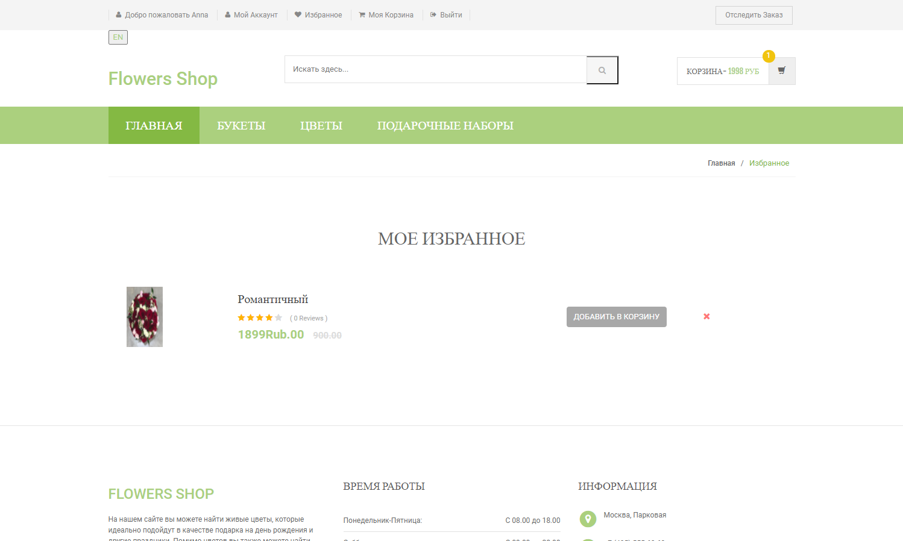

<!-- ABOUT THE PROJECT -->

 <h3 align="center">WEB PROJECT</h3>

  

    FLOWERS SHOP
     
    <a href="http://mirea-web-flower.0hi.me/ru/index.php/"><strong>View our website »</strong></a>
     
     
  

## О проекте

   
  
   
   

<strong>Flowers Shop</strong> Был создан сайт, посвященный по больше части продаже цветов и также некоторым другим подаркам (например, игрушки, сладости вместе с букетами). Данный проект относится к изучаемому предмету в РТУ МИРЭА - «Технология разработки программных приложений». Он был реализован группой из 4х человек, а именно: Чан Тхи Тху Хоан, Корзун Надежда Алексеевна, Маковеев Андрей Александрович и Чан Хоанг Ань, учащейся в РТУ МИРЭА в учебной группе ИНБО-04-19.  На данном сайте можно купить цветы, букеты цветов и подарочные наборы. Есть возможность добавить товар в избранное и отследить покупку. Сайт достаточно удобный в использовании. 
### Режимы доступа с логином

- Администратор
- Покупатель 

### Функции с логином

- Возможность добавить товар в избранное
- Покупать товар
- Отслеживание заказа

### Функции без логина
- Возможность добавить товар в корзину
- Отслеживание заказа

### Используемые языки

- PHP
- HTML/CSS/Javascript

### Используемые поставщики

- [Bootstrap](https://getbootstrap.com)
- [FontAwesome](https://fontawesome.com)
- [JQuery](https://jquery.com)
- [Perfect scrollbar](https://github.com/mdbootstrap/perfect-scrollbar)
- [GoogleFont](https://fonts.google.com/)
- [Lightbox](https://lokeshdhakar.com/projects/lightbox2/)
- [Owl carousel](https://owlcarousel2.github.io/OwlCarousel2/)
<!-- GETTING STARTED -->

## Рекомендации

Сайт оптимизирован только для настольных платформ. Пожалуйста, используйте рабочий стол при доступе к веб-сайту. Для оптимальной работы мы рекомендуем использовать следующие браузеры Chrome: 
- Microsoft Edge
- Chrome.

## Использование
Войдите в систему с доступными демо-счетами, чтобы в полной мере воспользоваться всеми функциями.

### Демо аккаунты:

- [Для покупателя 1] Email: anna@gmail.com | Password: 12345678
- [Для покупателя 2] Email: hoanganhmirea@gmail.com | Password: 123456789
- [Для администратора] Email: admin | Password: 123456789

### Демо скриншоты:

   
  
   

   
  
   

   
  
   

   
  
   

   
  
   

   
  
   

   
  
   

   
  
   

   
  
   

   
  
   

 

<!-- CONTACT -->

## Создатели

1. Чан Тхи Тху Хоан [github@tranthuhoan99](https://github.com/tranthuhoan99)
2. Корзун Надежда Алексеевна  [github@Na-Tyan](https://github.com/Na-Tyan)
3. Маковеев Андрей Александрович  [github@WILDFIFE14](https://github.com/WILDLIFE14)
4. Чан Хоанг Ань  [github@laughingmirea](https://github.com/laughingmirea)

